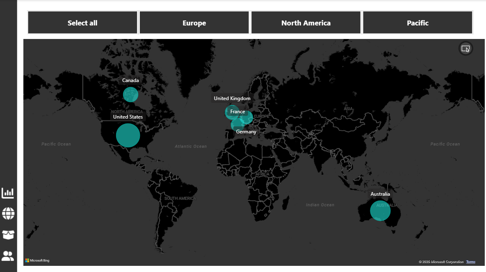

# 📊 AdventureWorks Power BI Report

This repository contains an **interactive Power BI report** built using the **AdventureWorks dataset**, a widely used sample database for business intelligence and analytics.  
The project demonstrates the end-to-end process of **data transformation, data modeling, DAX calculations, and interactive dashboard design**.

---

## 🎯 Project Overview

The purpose of this project is to turn raw AdventureWorks data into a meaningful reporting solution that enables stakeholders to:

- Monitor **executive-level KPIs** (sales, revenue, profit, returns)  
- Explore **customer profiles, demographics, and segmentation**  
- Analyze **product sales performance and profitability**  
- Visualize **regional and geographic trends**  
- Navigate with **tooltips, filters, slicers, and drill-throughs**  

This project showcases **best practices in Power BI** including data modeling, DAX, storytelling with visuals, and dashboard interactivity.

---

## 📸 Report Screenshots

### 1. Executive Dashboard  

### 2. Customer Detail  

### 3. Product Detail  

### 4. Category Tooltip  

### 5. Map View  

### 6. Model View  

---

## 🛠️ Tools & Techniques Used

- **Power BI Desktop** – main BI development tool  
- **Power Query (M)** – for data connection, cleaning, and transformation  
- **Relational Data Modeling** – star schema with relationships across fact and dimension tables  
- **DAX (Data Analysis Expressions)** – for KPIs, time intelligence, and calculated measures  
- **Dashboard Design Principles** – layout, slicers, filters, drill-through, bookmarks, and tooltips  

---

## 📖 About the Dataset

The **AdventureWorks dataset** is a sample database from Maven Analytics, simulating a multinational manufacturing company.  
It includes data on:  
- **Sales transactions**  
- **Customers and demographics**  
- **Products and categories**  
- **Territories and regions**  

This makes it a widely used dataset for **learning and demonstrating business intelligence solutions**.  

---

## 📬 Feedback & Contributions

- Suggestions, improvements, and contributions are always welcome  
- If you found this useful, please ⭐ the repository to support  
- Feel free to fork the repo and build upon the project  

---

✅ **This project is a portfolio showcase of Power BI skills using the AdventureWorks dataset.**
